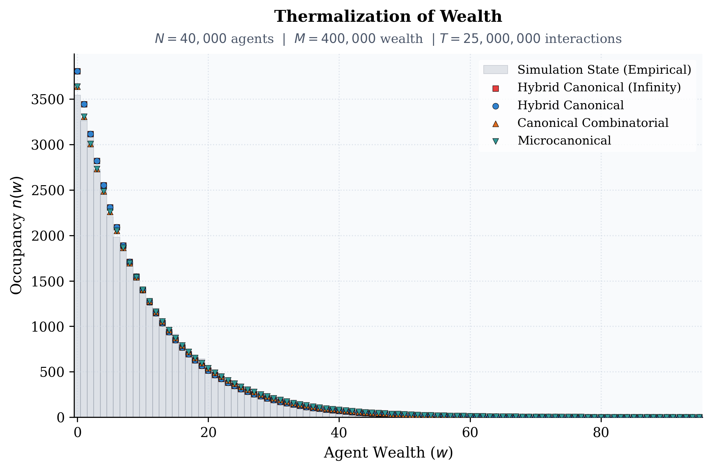
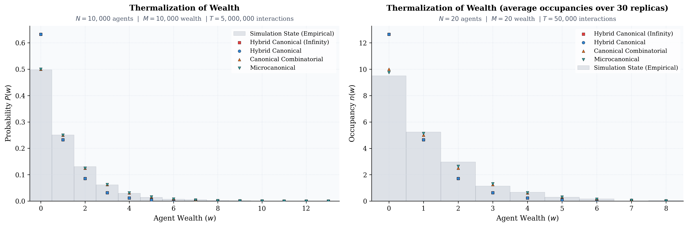

# Statistical Mechanics of Economic Systems: Multi-Scale Modeling of Wealth Distribution

This project applies the principles of Statistical Physics to model how money moves within an economy. By treating economic agents as "atoms" and money as "energy," we simulate how microscopic trade rules dictate macroscopic economic patterns—such as the formation of a resilient middle class or the mathematical inevitability of inequality.

Rather than viewing wealth distribution strictly through the lens of social policy, this project treats it as a structural property of maximum entropy and phase-space geometry in closed systems.

---

## Academic Foundation & Context
This project stands on the shoulders of foundational econophysics literature. Rather than re-developing kinetic wealth exchange theory from scratch, this framework implements, extends, and critiques established models:
*   **The Exponential/Gibbs Base:** **Drăgulescu and Yakovenko (2000)**, who rigorously established that random asset exchange in a closed system mirrors the Boltzmann-Gibbs distribution of an ideal gas.
*   **The Saving Propensity Hump:** **Chakraborti and Chakrabarti (2000)**, who introduced fixed saving propensities ($\lambda$), proving that capital inertia transforms the exponential distribution into a Gamma-like distribution, mathematically generating a modern "middle class."

---

## From Physics to Business: The Multi-Scale Mapping

This model translates abstract physical constants into explicit economic indicators across shifting scales of systemic liquidity.

| Physics Concept | Economic Equivalent | Real-World Structural Insight |
| :--- | :--- | :--- |
| **Energy ($E$)** | Capital Supply | Currency is strictly conserved during isolated peer-to-peer trade transactions. |
| **Entropy ($S$)** | State Space Volume | A measure of the distinct ways a specific total wealth can be distributed among agents. |
| **Beta ($\beta = 1/kT$)** | Wealth Density | Determines the purchasing power. |
| **Inertia / Mass** | Saving Propensity | The fraction of wealth sheltered from individual trades, inducing structural stability. |
| **Chemical Potential ($\mu$)** | Elastic Entry Cost | The marginal ease of introducing credit or capital into a fluctuating money supply. |

---

## Evolutionary Phases of the Project

### Phase 1: Micro-Scale Mechanics & The Quantized Limit
We evaluate closed, small-scale economic systems where wealth is highly quantized (e.g., local token-based economies, liquidity-starved cohorts, or micro-market simulations where $N \approx M$). 

**Core Finding:** Continuous or even hybrid approximations are imprecise at this granularity. True discrete frameworks (microcanonical or canonical) are required to capture market behavior. The naive continuous "heat-bath" assumption overestimates by $\approx 26.5\%$. Asset quantization fundamentally limits accessible systemic microstates. This behavior is observed not only at small systems, but all discrete systems where the number of agents is comparable equal to the number of available wealth levels.

### Phase 2: Macro-Scale Thermalization & Continuous Transitions [Current]
As the economy scales ($M, N \to \infty$) and enters the fluid, high-liquidity limit ($M \gg N$), discrete combinatorics smoothly relax into continuous thermodynamic distributions. This justifies a mathematical phase transition. We move from integer-based combinatorics to continuous space. Here, we implement the idealized Drăgulescu-Yakovenko gas phase, demonstrating how perfect initial equality spontaneously "melts" into an exponential inequality profile driven purely by entropic maximization.

### Phase 3: The Inertial Economy & Middle-Class Formation [Planned]
By introducing a homogeneous Saving Propensity ($\lambda > 0$) based on the Chakraborti-Chakrabarti model, agents are restricted from risking their entire net worth in a single transaction. This constraint introduces a zero-wealth boundary shield, shifting the exponential curve into a Gamma Distribution and creating the characteristic "hump" that represents a stabilized middle class.

### Phase 4: Pareto Tails & Multi-Agent Heterogeneity [Planned]
By relaxing the uniform saving rule and distributing heterogeneous saving propensities across the population, the system undergoes a structural phase transition. The top tier of the distribution detaches from the chaotic thermal background, naturally evolving a Power Law (Pareto) tail that dictates how the "Top 1%" emerges from distinct statistical rules.

### Phase 5: Grand Canonical Fields (Elastic Money Supply) [Planned]
Modern macroeconomies do not operate under a strict "Gold Standard" or fixed-asset conservation law. This phase transitions the architecture from a Canonical framework to a Grand Canonical Ensemble. By introducing the **Chemical Potential of Money ($\mu$)**, we simulate an elastic money supply driven by credit expansion, inflation targets, and central bank interest rates.

### Stage 5: Behavioral Tomography & Inference (Machine Learning Phase) [New, In Progress]

Instead of just running simulations forward, we use Data Science and Machine Learning to invert the pipeline: treating observational wealth data as an input to infer the underlying microscopic behavioral mechanics ($\lambda$, $\beta$, or market friction) without direct access to agent ledgers.

Insight: This mirrors real-world economics, where central banks only see macroscopic snapshots (Gini coefficients, tax brackets) and must infer consumer behaviors to set monetary policy.

---

## Simulation-First Philosophy: Ensemble Models as Symmetry Baselines

A core tenet of this repository is that **the simulation execution defines the ground truth**, while analytical statistical mechanics models are static, integrated approximations. 

The analytical frameworks do not possess or dictate real-time economic or physical dynamics. Instead, they calculate the maximum entropy configuration under absolute conservation laws, assuming a perfectly unconstrained, unbiased phase space traversal.

We treat these analytical equations not as prescriptive targets to bend our code toward, but as **Symmetry Baselines**:

* **Convergence** proves that the underlying microscopic algorithms preserve fundamental geometric symmetries and unbiased ergodicity.
* **Divergence** does not represent a broken simulation, but rather a structurally modified universe where an algorithmic interaction rule actively deforms phase space geometry.

---

## Empirical Validation Pipeline

To ensure the framework is a predictive economic tool rather than a purely mathematical metaphor, upcoming phases will plug the simulation outputs into an empirical validation engine. We will fit and test (MLE / KS-Test) our generated distributions against real-world macro-data:

*   **Low-to-Mid Income Brackets:** Validating the thermal exponential and Gamma "humps" against the **IPUMS Current Population Survey (CPS)** and **US Census Bureau** data.
*   **The Upper Tail:** Benchmarking our heterogeneous Pareto phase transitions against the **IRS Tax Bracket statistics** and the **World Inequality Database (WID)** to check if our simulated power-law exponents match real-world Gini coefficients and wealth concentrations.

---

## Technical Architecture
*   `src/`: core Python engines handling agent-based trading execution.
*   `docs/`: analytical write-ups, including physics-inspired modeling and simulated data and empirical validation, mathematical derivations, full proofs of multi-scale convergence, and ensemble breakdown boundaries.
*   `notebooks/`: simulations, consistency with predictions and properties inference.
